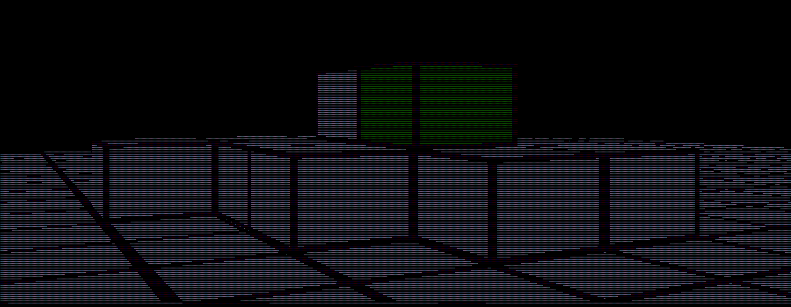
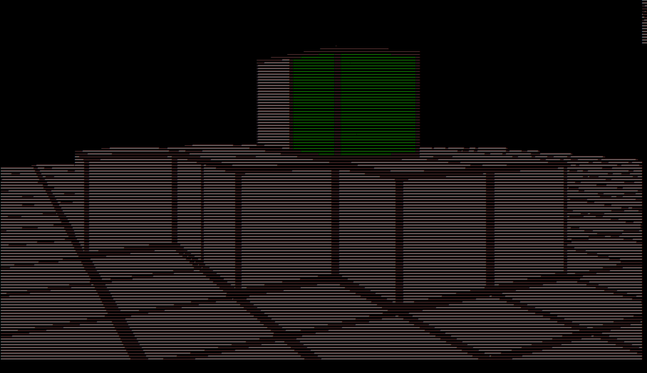

# 🐼 Minecraft-style Raycasting Engine in C using SDL2

This project is a simple **3D raycasting engine** inspired by *Minecraft-style blocky visuals*, written in **C**. It renders a 3D world based on a 2D map and supports basic player movement and camera control.

---

## 🚀 Features

- 3D raycasting engine
- Block-style rendering similar to Minecraft
- Player movement and strafing
- Easy-to-edit map
- Texture loading (walls)
- Written in modern C

---

## 🛠️ Requirements

- C and gcc compiler installed

---

## 🔧 How to Build

Clone the repository:
```bash
git clone https://github.com/sahilmadaan048/minecraft.git
cd minecraft
gcc minecraft.c -o minecraft
```

This will create the executable `minecraft`.

---

## ▶️ Running the Project

Use the following command:
```bash
./minecraft
```

---

## 🕹️ Controls

| Key   | Action              |
|-------|---------------------|
| `i`   | Move forward         |
| `j`   | Move backward        |
| `k`   | Strafe left          |
| `l`   | Strafe right         |
| `w`   | Look up              |
| `s`   | Look down            |
| `a`   | Look left (turn)     |
| `s`   | Look right (turn)    |
| `q` | Exit the game        |

These controls allow full movement and camera orientation within the 3D-rendered world.

---


## 📸 Screenshots





---

## 🎥 Demo Video

Watch a demo of the raycasting engine in action:

[](https://www.youtube.com/watch?v=doJOAkkuHcE)

---


## 📁 Project Structure

```
minecraft/
├── main.cpp
├── Makefile
├── images/
│   ├── screenshot1.png
│   └── screenshot2.png
├── README.md
```

---

## 📜 License
Copyright (c) 2025 sahilmadaan048

Permission is hereby granted, free of charge, to any person obtaining a copy
of this software and associated documentation files (the "Software"), to deal
in the Software without restriction, including without limitation the rights
to use, copy, modify, merge, publish, distribute, sublicense, and/or sell
copies of the Software, and to permit persons to whom the Software is
furnished to do so, subject to the following conditions:

The above copyright notice and this permission notice shall be included in all
copies or substantial portions of the Software.

THE SOFTWARE IS PROVIDED "AS IS", WITHOUT WARRANTY OF ANY KIND, EXPRESS OR
IMPLIED, INCLUDING BUT NOT LIMITED TO THE WARRANTIES OF MERCHANTABILITY,
FITNESS FOR A PARTICULAR PURPOSE AND NONINFRINGEMENT. IN NO EVENT SHALL THE
AUTHORS OR COPYRIGHT HOLDERS BE LIABLE FOR ANY CLAIM, DAMAGES OR OTHER
LIABILITY, WHETHER IN AN ACTION OF CONTRACT, TORT OR OTHERWISE, ARISING FROM,
OUT OF OR IN CONNECTION WITH THE SOFTWARE OR THE USE OR OTHER DEALINGS IN THE
SOFTWARE.

---

## 🙌 Credits

- Project by [Sahil Madaan](https://github.com/sahilmadaan048)
- Inspired by Wolfenstein 3D & Minecraft visuals